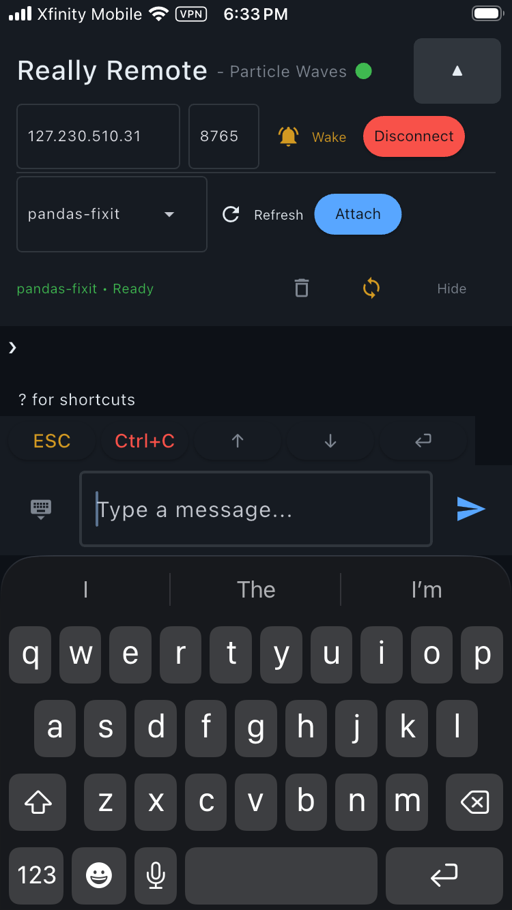
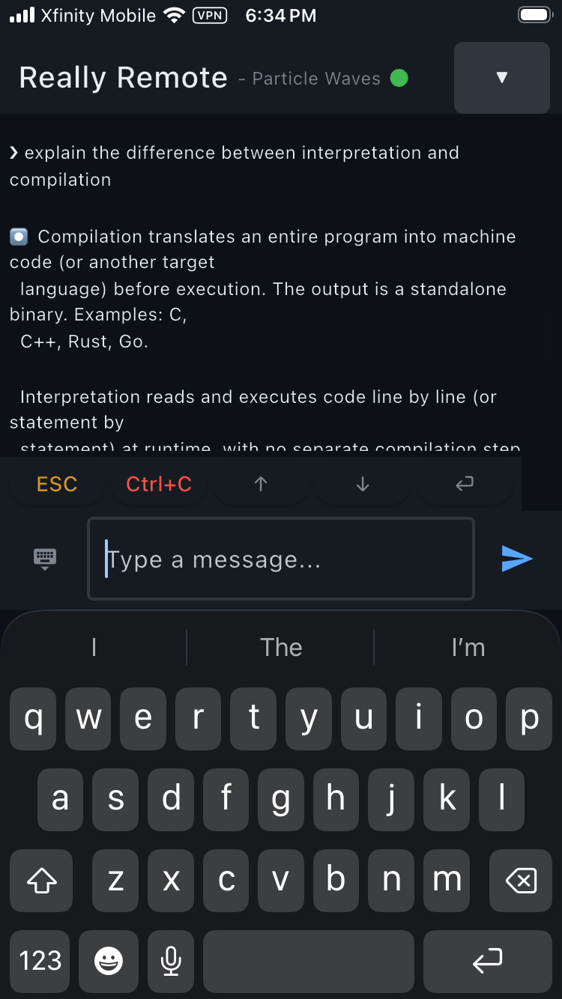

# Really Remote Relay Server

A WebSocket relay server that bridges tmux terminal sessions to remote clients. Run it on any machine with tmux, and control your terminal sessions from a phone, tablet, or any WebSocket client.

## Quick Start
1. Connect both your Mac and iPhone to TailScale VPN (download: https://tailscale.com)
2. Start Tmux sessions for any terminals you need (download: https://github.com/tmux/tmux/releases)
3. Start Relay Server
```bash
pip install -r requirements.txt
python server.py # default port 8765
```
4. Open ReallyRemote on your iPhone, connect and attach to a session.

-------




-------

## How It Works

```
┌──────────┐                  ┌─────────────────────────────────────────────┐
│  Client  │    Tailscale     │              Your Machine                   │
│ (phone)  │ ◄─────────────►  │  ┌──────────────┐    tmux    ┌───────────┐  │
│          │   encrypted      │  │ Relay Server │ ◄───────►  │   tmux    │  │
└──────────┘   WireGuard      │  │  (this repo) │  CLI calls │  sessions │  │
               tunnel         │  └──────────────┘            └───────────┘  │
                              └─────────────────────────────────────────────┘
```

All traffic between your phone and the relay server travels over a [Tailscale](https://tailscale.com) VPN tunnel (WireGuard encrypted). The server is never exposed to the public internet — only devices on your tailnet can reach it. No authentication is needed at the application layer because Tailscale handles identity and access control at the network layer.

The relay server sits between your clients and tmux. It:

- Accepts WebSocket connections from any number of clients
- Lists, creates, attaches to, and kills tmux sessions
- Continuously captures terminal output and broadcasts it to all connected clients
- Forwards keyboard input from clients into the active tmux session
- Strips ANSI escape codes so clients receive clean, readable text
- Debounces output to avoid flooding clients during rapid terminal updates
- Tracks "busy" state (content still changing) so clients can show activity indicators

## Requirements

- Python 3.8+
- tmux
- `websockets` Python package

## Quick Start

```bash
pip install -r requirements.txt
python server.py
```

The server starts on `ws://0.0.0.0:8765` by default.

### Options

```
python server.py --host 0.0.0.0 --port 8765
```

| Flag | Default | Description |
|------|---------|-------------|
| `--host` | `0.0.0.0` | Interface to bind to. Use `127.0.0.1` for local-only access. |
| `--port`, `-p` | `8765` | WebSocket port. |

## Protocol

All messages are JSON objects with a `type` field. The full protocol is defined in `protocol.py`.

### Server → Client

| Type | Fields | Description |
|------|--------|-------------|
| `output` | `content` | Terminal output text (ANSI stripped) |
| `status` | `connected`, `session`, `is_busy` | Current connection and session state |
| `sessions` | `sessions`, `active` | List of tmux session names and which is attached |
| `pong` | | Reply to a ping |

### Client → Server

| Type | Fields | Description |
|------|--------|-------------|
| `input` | `content`, `key` | Send text or a raw tmux key (e.g. `Escape`, `C-c`, `Up`) |
| `command` | `action`, `session`, `command` | Control command (see below) |


## Architecture

The server is two files:

- **`server.py`** — The `RelayServer` class and entry point. Manages WebSocket connections, tmux subprocess calls, and the output capture loop.
- **`protocol.py`** — Dataclass message types and JSON serialization. Shared between server and client.

### Output Capture

The server polls `tmux capture-pane` every 150ms. To avoid sending duplicate or rapidly-changing content:

- **Debounce** (0.5s): Output is only sent after content has been stable for 500ms.
- **Max silence** (5s): If content has changed but never stabilized, it's force-sent after 5s.
- **Deduplication**: Content identical to the last broadcast is never re-sent.

### Input Handling

- **Text input**: Sent to tmux literally with `send-keys -l`, followed by an `Enter` key.
- **Special keys**: Sent as raw tmux key names (`Escape`, `C-c`, `Up`, `Down`, `Tab`, etc.) without the `-l` flag.

## Connecting with wscat

For quick testing without a full client app:

```bash
npm install -g wscat
wscat -c ws://localhost:8765
```

Then send JSON messages manually:

```json
{"type": "command", "action": "list"}
{"type": "command", "action": "attach", "session": "main"}
{"type": "input", "content": "echo hello"}
```

Recommendations:

- Bind to your Tailscale IP or `127.0.0.1` instead of `0.0.0.0` for tighter control.
- Run on a Tailscale tailnet or other VPN so only your devices can reach the server.
- Do not expose the raw server to the public internet without adding your own authentication layer!

### Example Messages

Attach to a session:
```json
{"type": "command", "action": "attach", "session": "main"}
```

Send text input (followed by Enter):
```json
{"type": "input", "content": "ls -la"}
```

Send a special key:
```json
{"type": "input", "content": "", "key": "C-c"}
```